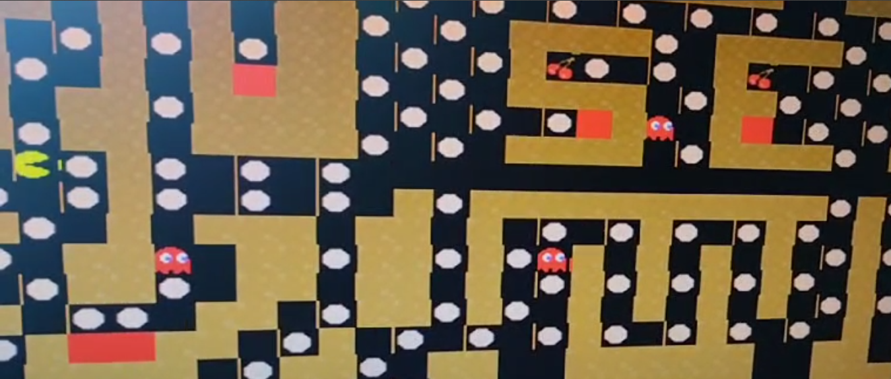

# 👾 Pac-Man in VHDL

This project is a hardware-based implementation of the classic **Pac-Man** game, designed entirely using **VHDL**. The game runs on an **FPGA development board** and uses VGA output for visual display. All the logic—from player control to ghost AI and collision detection—is written in pure hardware description code, with no microprocessor or external game engine.

---

## 🎯 Project Goals

- Learn and apply VHDL to design a complete digital system.
- Use state machines to control game logic.
- Implement real-time video signal generation for VGA output.
- Control movement using hardware buttons or switches.
- Simulate, test, and deploy a fully working retro game on FPGA.

---

## 🧱 System Architecture

## 🖥️ Platform & Tools

- **Board**: [Basys 3 / Nexys A7] (Xilinx FPGA)
- **Language**: VHDL (IEEE 1076)
- **Development Tools**: Vivado / ModelSim / GHDL
- **Display Output**: VGA 640x480 @ 60Hz
- **Inputs**: Onboard buttons or external switches

---

## 🕹️ Gameplay Features

- Grid-based movement for Pac-Man
- Static maze design
- Ghost enemies with predictable movement logic
- Collision detection (ghost hits and wall collisions)
- Basic score tracking and reset on game over
- VGA video output with pixel-based rendering

---

## 🔁 Finite State Machines

### Pac-Man FSM (Simplified):
- **IDLE** – Waiting for input  
- **MOVE_UP / DOWN / LEFT / RIGHT** – Updates position on clock  
- **COLLISION** – Checks for wall or ghost contact  
- **DEAD** – Triggers game over and resets

### Ghost FSM:
- Cycles through directions on wall contact  
- Simple AI based on random or pre-defined movement  

---

## 🧪 Testing & Simulation

Before deploying to hardware, all key modules were simulated using:
- **Testbenches** for `game_logic`, `vga_controller`, and `ghost_controller`
- **Waveform inspection** using ModelSim / Vivado Simulator
- **Behavioral and timing simulation** to ensure stable 60Hz frame generation and glitch-free movement

---

## 🖼️ Screenshots

---

